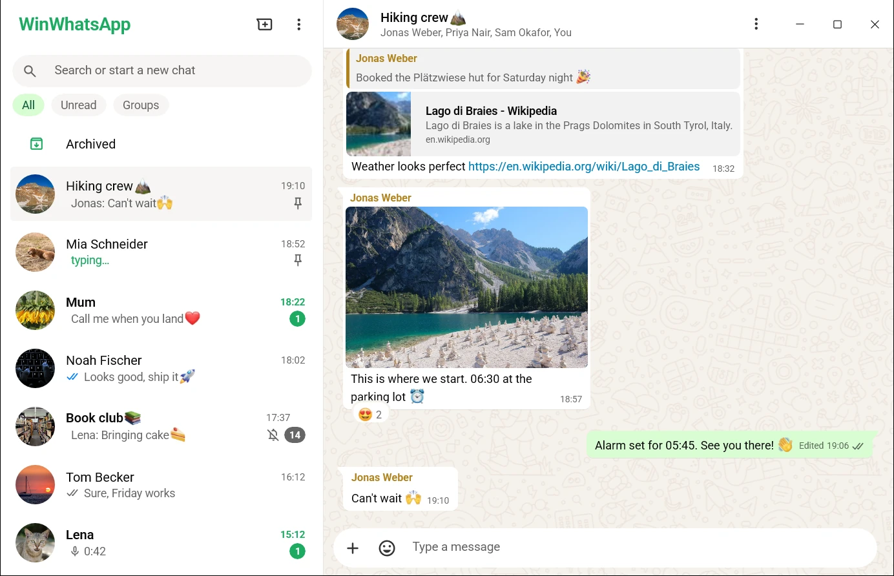
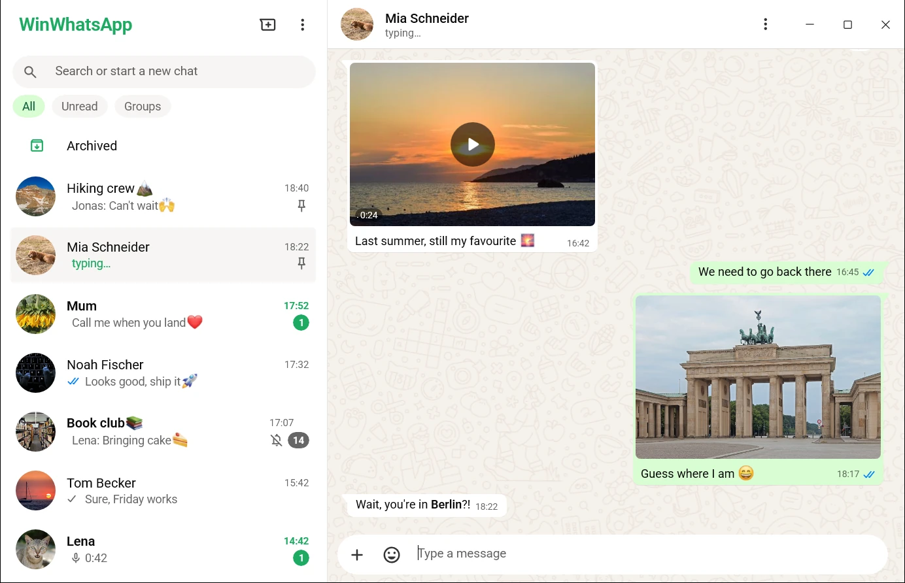
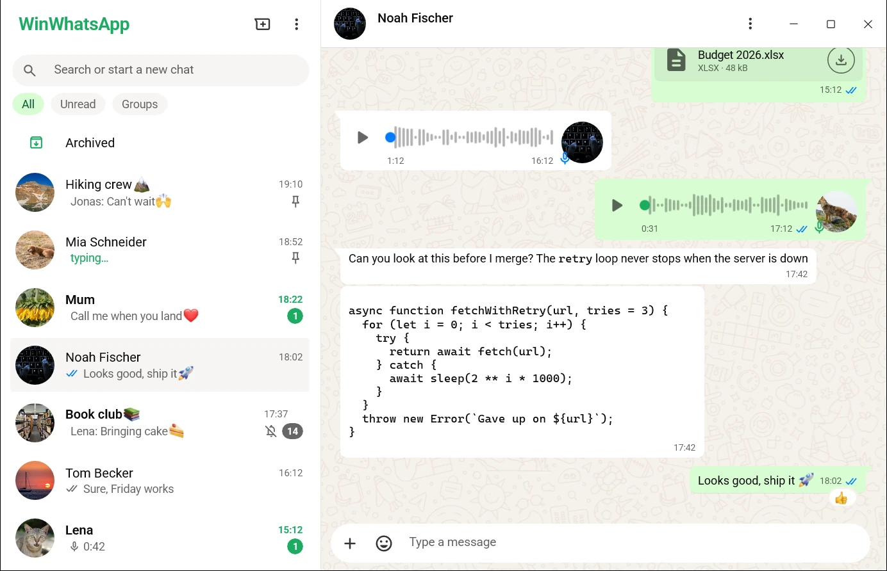
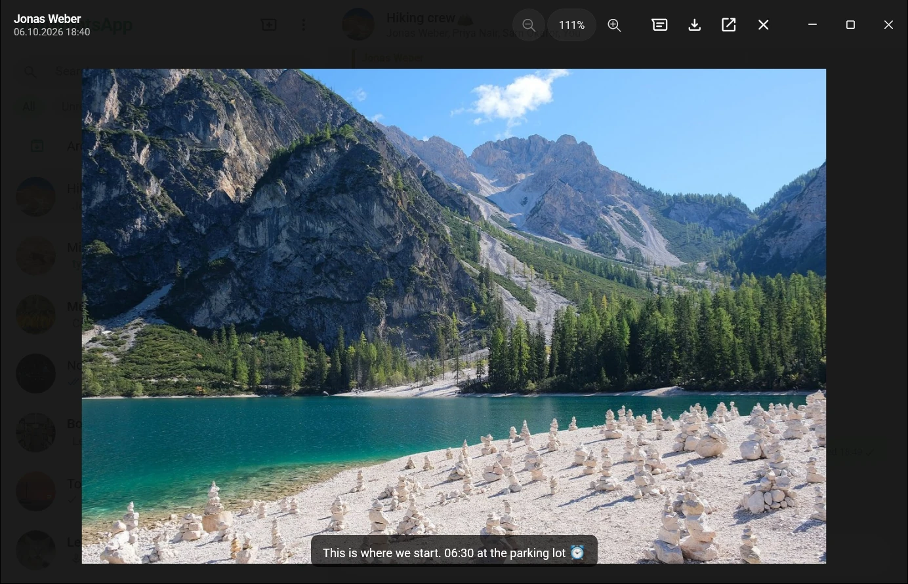
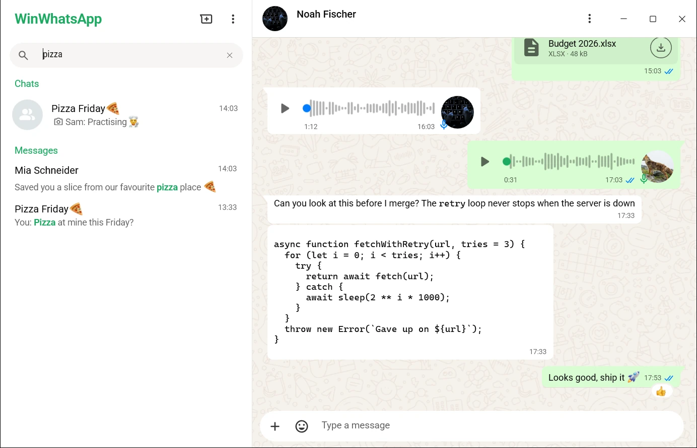
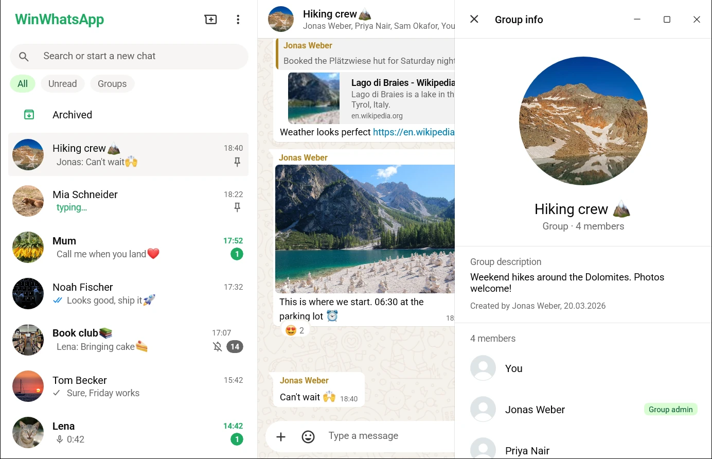
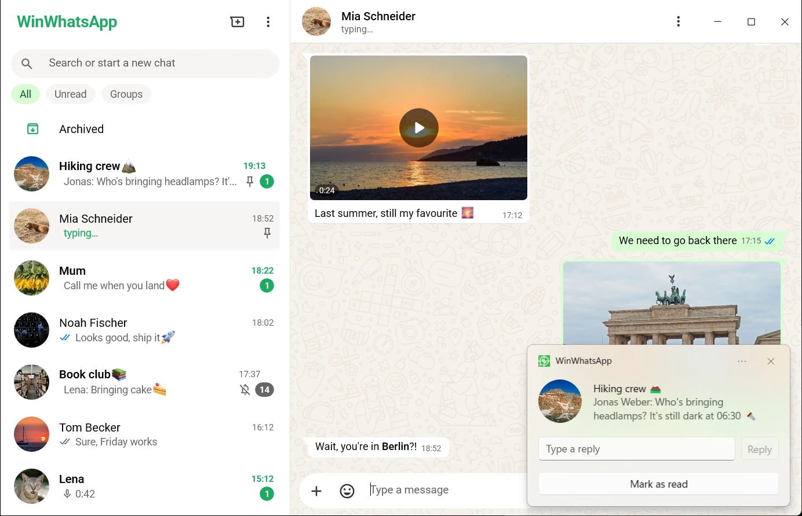
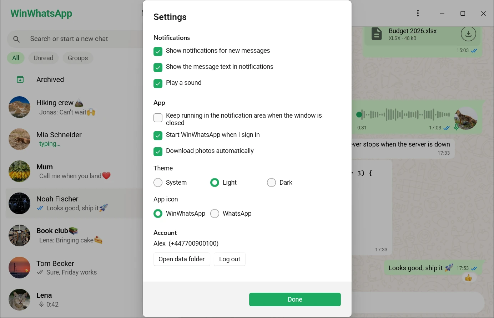
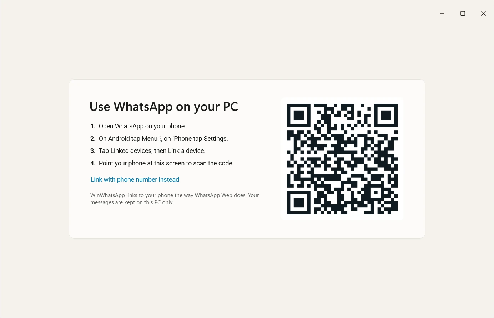

<p align="center">
  
</p>

# TwoTicks

A native WhatsApp app for Windows 11, and for macOS and Linux. It replaces the official app, which since 2025 is WhatsApp Web in a browser window: slow to start, slow to scroll, and a gigabyte of memory.

On Windows, TwoTicks is a WinUI 3 app. It opens in about half a second and uses around 180 MB with a few hundred chats. On macOS and Linux it is the same app, drawn by [Uno Platform](https://platform.uno). It links to your phone the way WhatsApp Web does, so the phone keeps your account and TwoTicks is one of its linked devices.

<p align="center">
  <picture><source media="(prefers-color-scheme: dark)" srcset="docs/screenshots/dark-chat.webp" /></picture>
  <br />
  <sub>A group chat with a link preview, a photo, reactions and an edited message</sub>
</p>

It looks like WhatsApp because it draws with WhatsApp Web's own emoji, icons, colours, chat wallpaper and font, in the light and the dark theme.

## Chats

- Your chats and recent history, synced from the phone when you link
- Pinned, muted and archived chats, in sync with the phone, and chats you mark as unread
- Filters for unread chats and groups above the list
- Unread counts, typing and online status, and the last time someone was seen
- The chat list and the chat side by side; drag the line between them to make the list wider or narrower

## Messages

- WhatsApp's formatting: \*bold\*, \_italic\_, \~strikethrough\~, \`inline code\` and \`\`\`code blocks\`\`\`
- Replies, @mentions, reactions and link previews
- Starring messages, in sync with the phone
- Editing your messages, and deleting for everyone or for you; press Up in an empty message box to edit your last one
- Photos, videos, GIFs, stickers, documents, voice messages and locations
- Read receipts: one tick, two ticks, two blue ticks
- Send photos, videos and files with a caption each: pick them, paste them or drop them on the chat

<p align="center">
  <picture><source media="(prefers-color-scheme: dark)" srcset="docs/screenshots/dark-media.webp" /></picture>
  <picture><source media="(prefers-color-scheme: dark)" srcset="docs/screenshots/dark-files.webp" /></picture>
  <br />
  <sub>Photos, a video and someone typing&nbsp;&nbsp;·&nbsp;&nbsp;Files, voice messages and code</sub>
</p>

## Photos and videos

Click a photo or video to open the viewer. It zooms, saves the file, opens it in another app and steps through every photo and video of the chat with the arrow keys.

## Search

The search field finds chats by name and messages by their text, across all chats. Click a message to jump to it.

<p align="center">
  <picture><source media="(prefers-color-scheme: dark)" srcset="docs/screenshots/dark-viewer.webp" /></picture>
  <picture><source media="(prefers-color-scheme: dark)" srcset="docs/screenshots/dark-search.webp" /></picture>
  <br />
  <sub>The photo and video viewer&nbsp;&nbsp;·&nbsp;&nbsp;Search across chats and messages</sub>
</p>

## Contact and group info

Click the name at the top of a chat to see who it is: the profile picture, the about text and the phone number of a person, or the description, the members and the admins of a group.

The info also holds what belongs to the chat, as in WhatsApp: its photos, videos, documents and links, its starred and kept messages, a search in it, muting, disappearing messages and the groups you share with the person. At the bottom you can clear or delete the chat, block the person or leave the group.

<p align="center">
  <picture><source media="(prefers-color-scheme: dark)" srcset="docs/screenshots/dark-group-info.webp" /></picture>
</p>

## Calls

Call someone with the phone button at the top of their chat, and answer calls that come in, in a small window of their own or from the notification. The window shows how long the call runs and has buttons to mute and to hang up.

Calls use WhatsApp Web's own calling engine, which TwoTicks downloads from WhatsApp once, after linking. On macOS and Linux the engine runs in a browser you have installed, without a window: Chrome, Chromium, Edge, Brave, Vivaldi or Firefox.

## On your desktop

- Notifications for new messages that you can reply to without opening the app
- An icon in the notification area and the number of unread chats on the taskbar button; on macOS the icon is in the menu bar and the number on the Dock
- Keeps running in the notification area when you close the window, so messages keep arriving
- Starts when you sign in, if you want
- Light, dark or the system's theme, and TwoTicks's own icon or WhatsApp's

<p align="center">
  <picture><source media="(prefers-color-scheme: dark)" srcset="docs/screenshots/dark-notification.webp" /></picture>
  <picture><source media="(prefers-color-scheme: dark)" srcset="docs/screenshots/dark-settings.webp" /></picture>
  <br />
  <sub>A notification you can reply to&nbsp;&nbsp;·&nbsp;&nbsp;Settings</sub>
</p>

| Keys | What they do |
|---|---|
| Ctrl+N, Cmd+N on a Mac | New chat |
| Ctrl+F, Cmd+F on a Mac | Search |
| Enter, Shift+Enter | Send, new line |
| Up | Edit your last message |
| Esc | Close the viewer or cancel a reply |
| Ctrl+S, Cmd+S on a Mac | Save the photo or video in the viewer |
| Left, Right, Home, End | Previous, next, first and last photo or video in the viewer |
| +, -, 0 | Zoom in, zoom out, fit to the window in the viewer |

## What it does not do

Calls are voice calls with one person. Video calls and group calls show a notification to answer them on the phone. Status updates, channels and communities are not shown.

## Install

All downloads are on the [releases page](https://github.com/rathlinus/WinWhatsApp/releases).

### Windows

You need 64-bit Windows 11.

Download `TwoTicks-<version>-Setup.exe` and run it. It installs for your user only and needs no administrator rights.

Setup is not signed, so Windows SmartScreen may stop it with "Windows protected your PC". Choose **More info**, then **Run anyway**.

The release also has `TwoTicks-<version>-x64.zip` for running without installing: unpack it anywhere and start `TwoTicks.exe`.

### macOS

Download `TwoTicks-<version>-macos-arm64.dmg` for a Mac with Apple silicon, or `-macos-x64.dmg` for one with an Intel processor. Open it and drag TwoTicks to Applications.

The app is not signed by Apple, so macOS refuses to open it with a double click the first time. Right-click it and choose **Open**, or allow it under System Settings, Privacy & Security.

macOS asks whether TwoTicks may send notifications, and for the microphone at your first call.

### Linux

On Debian, Ubuntu and their relatives, install `twoticks_<version>_amd64.deb`, or `_arm64.deb`:

```
sudo apt install ./twoticks_<version>_amd64.deb
```

Elsewhere, unpack `TwoTicks-<version>-linux-x64.tar.gz`, or `-arm64`, anywhere and start `TwoTicks` in it. It adds itself to the menu of your desktop.

The app brings .NET and its own fonts. Some things it leaves to programs you may already have. The package asks for them; with the archive you install them yourself.

| For | It needs |
|---|---|
| Voice messages and videos | VLC, as `libvlc5`, `vlc-plugin-base` and `vlc-plugin-video-output` on Debian and Ubuntu |
| Calls | Chrome, Chromium, Edge, Brave, Vivaldi or Firefox |
| The icon in the notification area | a desktop with one; GNOME needs the AppIndicator extension. Without it, closing the window minimizes it. |
| A preview of a video you send | `ffmpegthumbnailer` or `ffmpeg` |
| Choosing the microphone and speaker | `pactl`, which PulseAudio and PipeWire come with |

The window is an X11 window, which Wayland desktops show through XWayland.

### How far macOS and Linux are

They are new. Every change is built for both, and started on GitHub's machines with made-up chats to see that the window comes up as it should. On Linux the rest was tried by hand: notifications, the notification area, voice messages, videos, pasting, and a call as far as it gets without a second phone. On macOS nobody has clicked through the app yet, so expect rough edges there, and please report them.

## Updates

The installed app on Windows looks for new versions on GitHub and installs them by itself while its window is closed, or when you quit it. It then starts again where it was, in the notification area or with the window open. Settings, Updates turns this off or installs a new version right away; a small window then shows the download and the install until the new version opens. A copy from the zip, and the app on macOS and Linux, only tell you about new versions; download them from the releases page.

## Link your phone

Open TwoTicks, then on your phone open WhatsApp, go to Linked devices, tap Link a device and scan the code. If you can't scan, choose **Link with phone number instead** and type the code TwoTicks shows into your phone.

<p align="center">
  <picture><source media="(prefers-color-scheme: dark)" srcset="docs/screenshots/dark-link.webp" /></picture>
</p>

## A word of warning

WhatsApp has no public API for personal accounts. TwoTicks talks to WhatsApp's servers with [whatsmeow](https://github.com/tulir/whatsmeow), an open source implementation of the protocol of WhatsApp Web. Using a client WhatsApp did not make is against its terms of service, and WhatsApp can ban accounts for it. Bans of accounts that only chat normally are rare, but the risk is yours.

TwoTicks is not made by, affiliated with or endorsed by WhatsApp or Meta.

## Where your data is

Everything is in one folder: the link to your phone, the messages, downloaded files, settings and logs. It is `%LOCALAPPDATA%\TwoTicks` on Windows, `~/Library/Application Support/TwoTicks` on macOS and `~/.local/share/TwoTicks` on Linux. Nothing leaves your computer except what WhatsApp itself sends. The calling engine is kept in the `Calls` folder there. When you type a link, TwoTicks loads that page and its picture to show a preview, as WhatsApp's apps do. Logging out from the menu, or removing the device on the phone, deletes the messages and files.

## Build

See [docs/development.md](docs/development.md).

## License

TwoTicks's own code is under the [MIT License](LICENSE).

It includes work by others, under their own terms:

- [whatsmeow](https://github.com/tulir/whatsmeow), in the helper `TwoTicks.Bridge.exe`, under the Mozilla Public License 2.0
- [QRCoder](https://github.com/codebude/QRCoder), under the MIT License
- On macOS and Linux, [Uno Platform](https://github.com/unoplatform/uno) under the Apache License 2.0, [SkiaSharp](https://github.com/mono/SkiaSharp) under the MIT License, [Concentus](https://github.com/lostromb/concentus) under the BSD license and [LibVLCSharp](https://github.com/videolan/libvlcsharp) under the LGPL 2.1
- Roboto, by Google, under the Apache License 2.0
- WhatsApp's name, logo, emoji, icons, wallpapers and notification sounds belong to WhatsApp and Meta. They are not covered by the MIT License.

## Screenshots

The screenshots show made-up chats: the app runs on a stand-in for its WhatsApp helper that serves them, so no real account or person is in them. `scripts\screenshots\Take-Screenshots.ps1` takes them all again, in both themes; see [scripts/screenshots](scripts/screenshots).

The photos in them are from Wikimedia Commons, under CC0, public domain, CC BY-SA 3.0 and CC BY-SA 4.0. [CREDITS.md](scripts/screenshots/demo/CREDITS.md) lists each one with its author and license.
